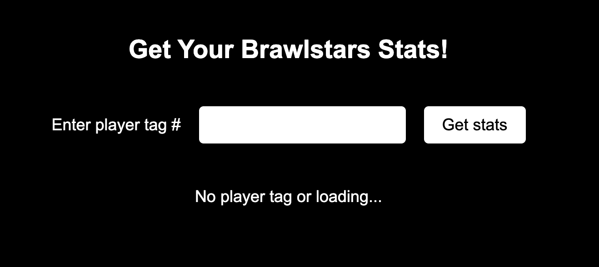
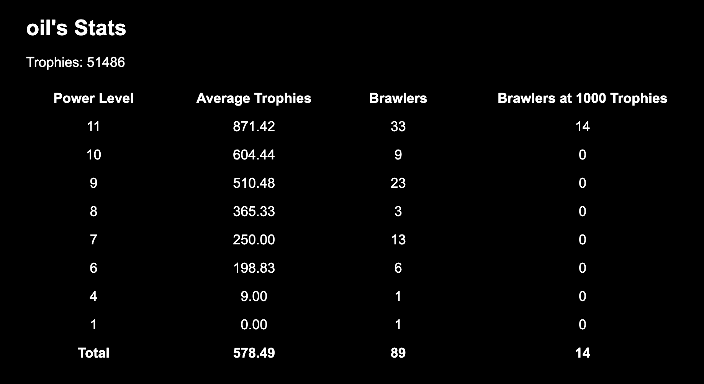
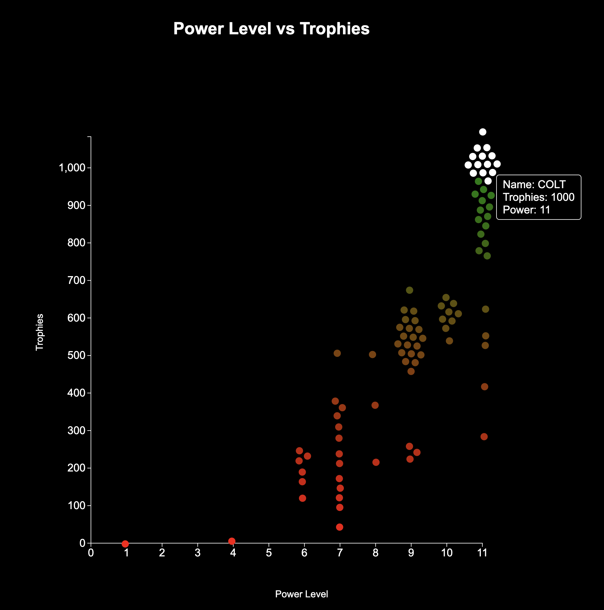

# Brawl Stars Stats Visualizer
A React + TypeScript + Vite + D3 project that visualizes Brawl Stars player data using the Brawl Stars API. The app displays updated trophy and power level statistics in both table and scatterplot form, with D3 providing interactivity and force directed spacing in the scatterplot for any player.

Note: This implementation only works locally due to the Brawl Stars API requiring a valid IP address for authentication. To make it publically accessible, a backend would need to be created to handle API requests securely with a single API key.

This material is unofficial and is not endorsed by Supercell. For more information see [Supercell's Fan Content Policy](https://supercell.com/en/fan-content-policy/)

## Home Page

## Data Visualizations

### Table

### Plot

## Follow these steps to set up and run the project
1. Ensure Node.js is installed  
`node -v`  
`npm -v`

2. Clone the repository and navigate to the project folder  
`git clone https://github.com/awprevite/brawlstars-stats.git`  
`cd brawlstars-stats`

3. Install dependencies  
`npm install`

4. Set up your API key  
Go to the [Brawl Stars API website](https://developer.brawlstars.com/#/) and create an account and API key  
Add your current IP address to the key's permissions

5. Create a .env file in the root of your project and store your API key  
`echo 'VITE_BRAWL_API_KEY="your-api-key"' > .env`

6. Start the development server  
`npm run dev`

7. Open in browser  
Go to the localhost URL displayed in your terminal to view the app